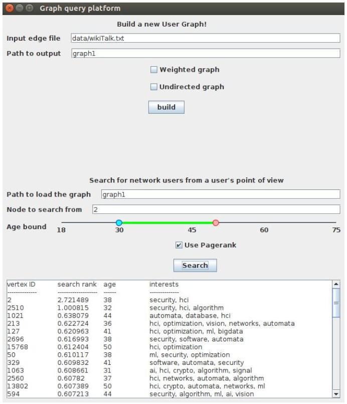

# Data-Intensive-Distributed-Computing
Big data processing frameworks (Spark, Hadoop), programming in Java and Scala, and numerous practical and well-known algorithms

#### This repository contains the Java and Scala implementations of the course project and the assignments of the data intensive distributed computing course (CS 651) at the University of Waterloo, Winter 2020. They cover a broad range of data intensive distributed problems such as text data analysis, graph data analysis. machine learning, GraphX library and distributed Graph RDD processing, and so on. In the following sections, I will describe the components of this work in more details.

## Project
**Graph Query System:** I implement a novel system for performing queries on large-scale graph structured data. To do this, I use **Spark GraphX** and **Pregel** libraries to create and load graphs, and perform distributed operations on them. Graph ranking metrics such as **shortest paths** and **PageRanks** are then applied to rank the results of the query. The following figure shows a graphical user interface of this system; for more information, you can read more about this article [here](files/query_system.pdf), and watch [this youtube presentation](https://youtu.be/cJQDDTHfTFQ).

## Assignments
### Assignment 7
**Spark streaming:** Given the [New York City Taxi & Limousine Commision trip transactions](https://toddwschneider.com/posts/analyzing-1-1-billion-nyc-taxi-and-uber-trips-with-a-vengeance/) data, an online streaming scenario is modeled in which trends of in-city trips are detected for the live data.

### Assignment 6
**Spam classification:** using Apache Spark, a Linear Regression model is trained which learns a binary classification task of detecting spam files. To this end, there are two steps of implementing this system. First one is to train the classifier from the given training data using gradient descent as the optimizer, and second, to evaluate the test data.

### Assignment 5
**SQL big data analytics:** Over a relational and structured database, which contains a set of Entity tables, specific SQL queries are performed. Each table has both of the simple text and the parquet formats, and query implementations support both types.

### Assignment 4
Multi-Source Personalized PageRank: performs Personalized PageRank (extension of PageRank algorithm where the nodes are ranked based on their (explicit or implicit) connections/interactions with a source node) for multiple source nodes simultaneously. (In Hadoop)

### Assignment 3
Inverted Indexing a body of text document and vocabulary and performing Information Retrieval (IR) on the indices. The codes are in Java/Hadoop

### Assignment 2
This assignment has the same problems as assignment 1, but the implementations are in Spark/Scala.

### Assignment 1
Written in Java/Hadoop, the goal is to compute the [Point-wise Mutual Information (PMI)](https://en.wikipedia.org/wiki/Pointwise_mutual_information), which is an association measure. PairsPMI and StripesPMI are two different implemenations of this algorithm in this repo.

### Assignment 0
This one has the simple algorithms of *Word Count* and *Bigram Relative Frequency* written in Hadoop/Java. It covers different types of combiners and optimizations that can enhance the performance of the distributed system by taking advantage of the local node computations.

